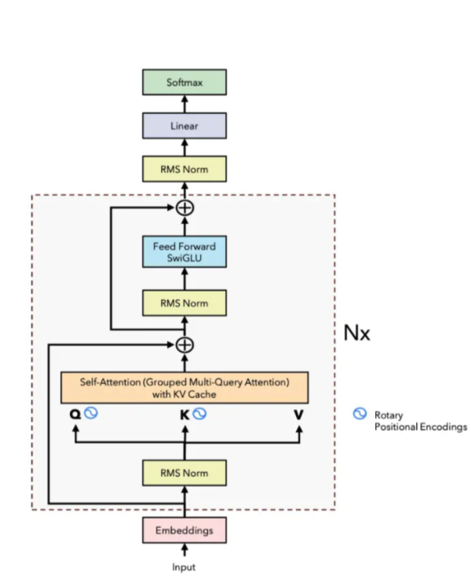

# Llama2Inference

This repository holds a Julia module called `Llama2Inference` and was created as part of course work at [TU Berlin](https://www.tu.berlin/).

The module enables the user to generate text by inferencing the large language model [Llama2](https://llama.meta.com/llama2/). The implementation is based on a [C implementation](https://github.com/karpathy/llama2.c/blob/master/run.c) of the inference pass for Llama2 by [Andrej Karpathy](https://github.com/karpathy).

## Architecture of Llama2 Decoder-Block

## Getting Started
Please follow the instructions given in the [docs](https://yangfelix.github.io/Llama2Inference.jl/dev/getting_started/).